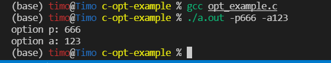
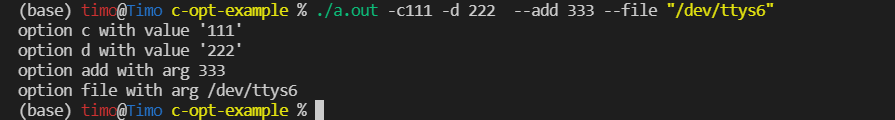

# c-opt-example
example for getopt


## run

+ getopt example:

```shell
gcc opt_example.c
./a.out -p666 -a123
```




+ getopt_long example:

```shell
gcc opt_long_example.c
./a.out -c111 -d 222  --add 333 --file "/dev/ttys6"  
```



